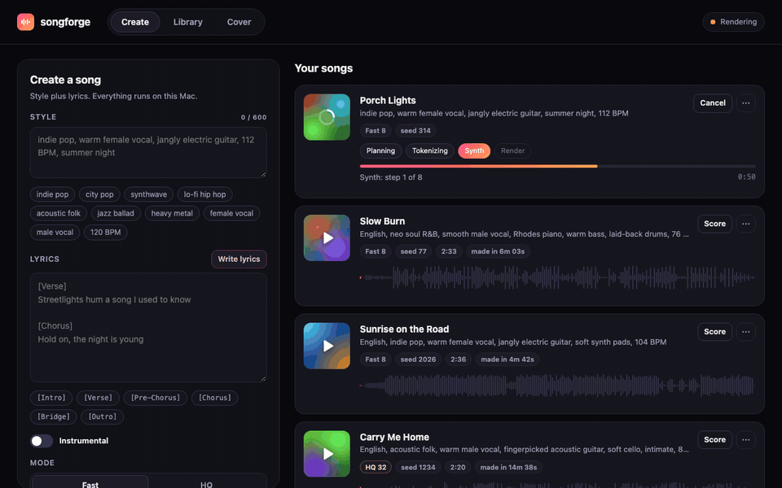
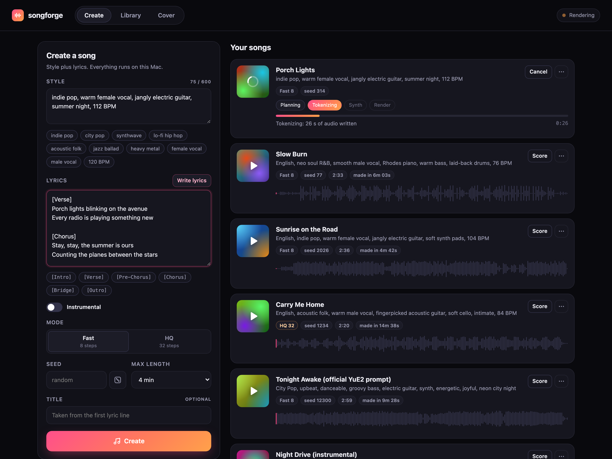
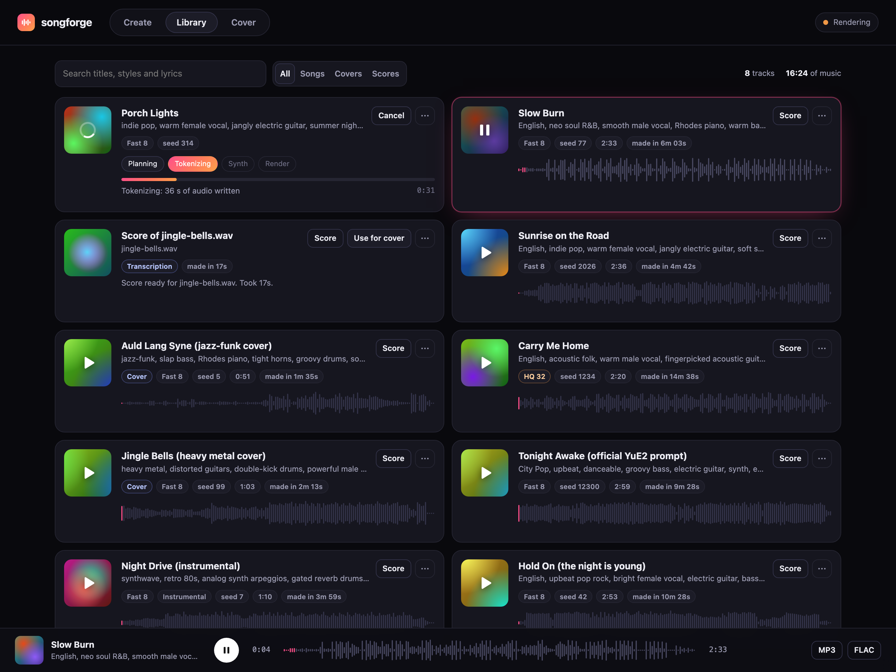
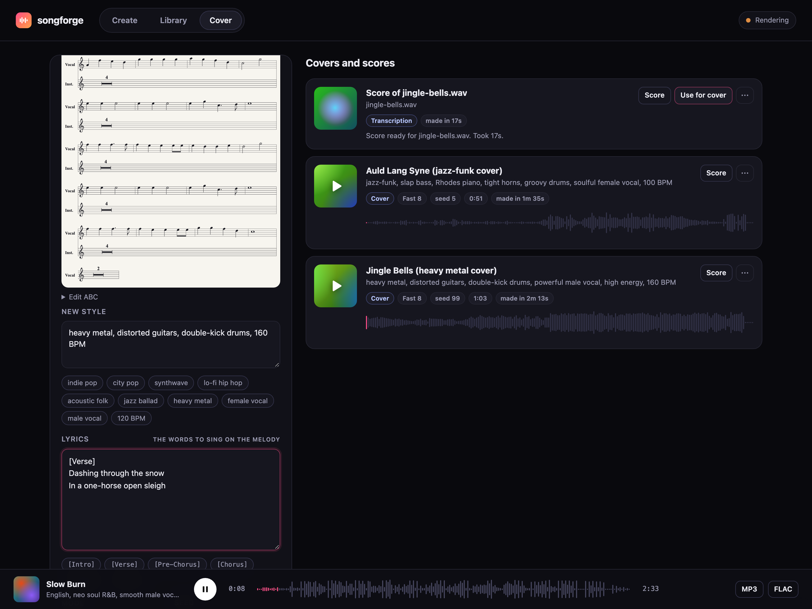

# songforge

A local, Suno-style song studio for Apple Silicon. On a MacBook Air it turned a style prompt and lyrics into a 2:53 song with vocals in 5 minutes 59 seconds[^1], with no GPU rental, no account and no subscription: a 10.4 GB download and $0 a month.



Lyrics plus a style prompt become a full song with vocals, and any recording can be covered in a new genre. A 60-second piano recording of Jingle Bells became a 1:03 heavy metal cover in 2 minutes 13 seconds, transcription included. YuE2-3B runs on the Mac through MLX.

[](https://github.com/Arthur031221/songforge/actions/workflows/ci.yml)
[](LICENSE)
[](CHANGELOG.md)

**Listen first:** [arthur031221.github.io/songforge](https://arthur031221.github.io/songforge/) has every demo song and cover, each with its prompt, seed and measured time.

## Why

Suno is good and costs $8 a month (Pro) or $24 a month (Premier), and every song lives on someone else's server. YuE2-3B is an open song model that its authors report as competitive with Suno v5 on their own benchmark, but the official release wants Linux and a 24 GB NVIDIA card. The Mac ports that exist are an engine without a UI, or a UI without covers. I wanted one command that turns my MacBook Air into the whole studio.

## Install

```bash
uv tool install git+https://github.com/Arthur031221/songforge
```

Or run it once without installing anything:

```bash
uvx --from git+https://github.com/Arthur031221/songforge songforge
```

songforge is not on PyPI yet, so plain `uvx songforge` does not work today. If that changes, the same command will read from PyPI instead.

Either way, the first run installs the MLX engine into its own environment under `~/.songforge`, downloads 10.4 GB of weights, verifies their hashes and opens the studio at http://127.0.0.1:7860. Covers download another 2.8 GB the first time you use them.

Needs an Apple Silicon Mac (M1 or later) on macOS 14.2 or later (26.2 or later on M5), [uv](https://docs.astral.sh/uv/), git, `brew install ffmpeg` for MP3 export and covers, and about 15 GB of free disk. The engine process peaked at 10.8 GiB in my runs on a 24 GB Mac. A 16 GB Mac should fit it with other apps closed, but I have not measured one.

From source:

```bash
git clone https://github.com/Arthur031221/songforge && cd songforge
uv run songforge
```

## Quick start

1. Run `uvx songforge`. Your browser opens the studio.
2. Type a style, for example `indie pop, warm female vocal, jangly guitar, 112 BPM`.
3. Paste lyrics with section tags (`[Verse]`, `[Chorus]`, `[Bridge]`), or press **Write lyrics** if Ollama is running.
4. Press **Create**. The card shows each stage live: Planning, Tokenizing, Synth, Render.
5. Play it in the library, download FLAC or MP3, or open the score.

From a terminal instead:

```bash
songforge generate --style "city pop, female vocal, groovy bass" \
  --lyrics-file lyrics.txt --out song.mp3
songforge cover old-recording.mp3 --style "jazz-funk, Rhodes, horns" \
  --lyrics-file new-words.txt --out cover.mp3
```

If the studio is running, these commands queue in it, so only one model ever loads.

| Create | Library | Cover |
|---|---|---|
| [](demo/create.png) | [](demo/library.png) | [](demo/cover.png) |

The score view renders the ABC notation YuE2 planned for the song ([screenshot](demo/score.png)).

## How it works

```
browser (index.html, no build step)
   |  REST + server-sent events
FastAPI server  --  SQLite job table (~/.songforge/songforge.db)
   |  one worker thread, one job at a time
engine child process (mlx-Yue in its own uv env, Python 3.12, MLX 0.32.2)
   Planning    8-bit AR model writes an ABC score for the lyrics
   Tokenizing  8-bit AR model writes 25 codec tokens per second of audio
   Synth       BF16 acoustic model, flow matching, 8 steps (Fast) or 32 (HQ)
   Render      VAE decode to 48 kHz stereo FLAC, then MP3 with ffmpeg
```

- The engine is [mlx-Yue](https://github.com/vanch007/mlx-Yue), a native MLX port of YuE2 with no PyTorch at runtime. songforge pins commit `9253ed1` and installs it with `uv sync --frozen` in `~/.songforge/engine`, so its exact dependency set never touches your other Python environments.
- Each job runs in a fresh child process. All model memory goes back to macOS when the song is done. A lock file in `~/.songforge` keeps it to one engine process at a time, even if you start jobs from the CLI while the studio runs.
- The 8-bit AR model plans and writes tokens. The acoustic stage conditions on the BF16 AR backbone, so the download includes both AR files (2.7 GB and 4.3 GB), the acoustic model (2.9 GB) and the VAE (0.5 GB).
- Weights are hashed once during setup. Later runs check file sizes and dates against that record instead of re-hashing 10 GB, which saves about 30 seconds per song.
- mlx-Yue ships a memory guard that stops a job at the first sign of system memory pressure. On a laptop with a browser open that fires too early, so songforge keeps the per-process budget (16 GiB) and stops only when macOS reports critical pressure for 10 seconds. `SONGFORGE_STRICT_MEMORY=1` restores the original guard.
- Covers use SheetSage2 and MERT-v2 (also MLX) to transcribe the recording to a melody-only ABC score. YuE2 then sings that melody in melody mode with your style and lyrics. You can review and edit the score before rendering. When the source has no sung line, a piano recording for example, the transcription puts the whole melody in the instrument voice and YuE2 would have nothing to sing on. songforge moves it to the vocal voice first.
- Write lyrics calls a local Ollama model (`qwen3:4b` by default) and is disabled while a song renders, so two models never compete for memory.

## Compared to

| Project | Runs on | Interface | Covers | Gap for a Mac user |
|---|---|---|---|---|
| [Suno](https://suno.com) | Cloud | Web | Yes | Not local. $8 a month (Pro) or $24 (Premier), songs are made on their servers |
| [YuE2-Studio](https://github.com/timoncool/YuE2-Studio) | Windows 10/11 x64, 6 GB+ GPU | Desktop app | Yes | No macOS build |
| [ace-step-ui](https://github.com/fspecii/ace-step-ui) | NVIDIA GPU listed as a requirement | Web | Yes (ACE-Step) | No Apple GPU path documented. Last commit 2026-06-27. Uses ACE-Step, not YuE2 |
| [YuE2Mac](https://github.com/arinltte/YuE2Mac) | Apple Silicon, MLX | Native macOS app | No | No covers, no CLI, no published generation times |
| [mlx-Yue](https://github.com/vanch007/mlx-Yue) | Apple Silicon, MLX | CLI and Python API | Yes | An engine, not a studio. songforge runs it |
| **songforge** | Apple Silicon, MLX | Browser studio, CLI, HTTP API | Yes | Mac only. Speed is bound by the Mac's GPU |

## Commands

Every command has `--help`. Commands that print results accept `--json`.


| Command | What it does |
|---|---|
| `songforge` | Same as `songforge serve`. Runs setup on first use, starts the studio and opens the browser |
| `songforge serve [--port 7860] [--host 127.0.0.1] [--no-browser] [--yes] [--skip-setup]` | Start the studio |
| `songforge setup [--covers]` | Install the engine, download and verify weights. `--covers` also fetches the transcription models |
| `songforge doctor` | Check the Mac, engine, weights, ffmpeg and Ollama, and show disk use |
| `songforge generate --style S (--lyrics T \| --lyrics-file F \| --instrumental) [--mode fast\|hq] [--seed N] [--max-seconds 240] [--title T] [--out song.mp3]` | Make one song |
| `songforge cover AUDIO --style S [--lyrics-file F] [--task melody-full\|melody-vocal] [--abc score.abc] [--mode fast\|hq] [--out cover.mp3]` | Cover a recording |
| `songforge list [--limit 50]` | Show the library |
| `songforge bench [--mode fast\|hq] [--max-seconds 240] [--seed 42] [--request file.json]` | Time one song: wall time, real-time factor, peak RSS and peak footprint |

Environment variables:

| Variable | Default | Meaning |
|---|---|---|
| `SONGFORGE_HOME` | `~/.songforge` | Engine, weights, library and uploads |
| `SONGFORGE_OLLAMA_URL` | `http://localhost:11434` | Ollama server for Write lyrics |
| `SONGFORGE_LYRICS_MODEL` | `qwen3:4b` | Ollama model for Write lyrics |
| `SONGFORGE_STRICT_MEMORY` | unset | `1` restores mlx-Yue's strict memory guard |
| `SONGFORGE_ENGINE` | `mlx` | `fake` runs a test engine that needs no weights |

HTTP API, used by the studio and handy for scripts: `POST /api/songs`, `GET /api/songs`, `GET /api/songs/{id}`, `POST /api/songs/{id}/cancel`, `DELETE /api/songs/{id}`, `GET /api/songs/{id}/audio.{flac,mp3}`, `GET /api/songs/{id}/score.abc`, `POST /api/uploads?name=file.mp3`, `POST /api/transcribe`, `POST /api/covers`, `POST /api/lyrics`, `GET /api/events` (server-sent events), `GET /api/status`.

## Benchmark

`songforge bench` times one song end to end and prints wall time, real-time factor (wall time divided by audio length, lower is faster), peak RSS and peak footprint. MLX allocates most of its memory as Metal buffers that RSS does not count, so the footprint is the number that matters. Peak RSS ranged from 2.6 to 5.3 GiB across the runs below while the footprint reached 10.8 GiB.

Output of `songforge bench` on the idle Mac:

```
engine            mlx (YuE2-3B, AR 8-bit)
mode              fast (8 steps), seed 42
wall time         5m 59s
audio length      2m 53s
real-time factor  2.081 (wall / audio, lower is faster)
peak RSS          4.7 GiB
peak footprint    10.8 GiB
machine           Apple M5 24 GB, macOS 26.6
```

Every generation made for this README and the listening page, one completed run each, same MacBook Air M5 with 24 GB:

| Track | Mode | Audio | Wall time | Real-time factor | Peak footprint |
|---|---|---|---|---|---|
| `songforge bench` (English pop rock, seed 42) | Fast | 2:53 | 5 min 59 s | 2.08 | 10.8 GiB |
| Sunrise on the Road (indie pop, lyrics from Write lyrics) | Fast | 2:36 | 4 min 42 s | 1.81 | 10.1 GiB |
| Slow Burn (neo soul R&B) | Fast | 2:33 | 6 min 03 s | 2.37 | 10.4 GiB |
| Porch Lights (indie pop, made while capturing the screenshots) | Fast | 1:00 | 1 min 17 s | 1.27 | 10.1 GiB |
| Tonight Awake (official YuE2 prompt, City Pop) | Fast | 2:59 | 9 min 28 s | 3.18 | 10.5 GiB |
| Hold On (the bench song, first run) | Fast | 2:53 | 10 min 28 s | 3.64 | not recorded[^2] |
| Night Drive (synthwave, instrumental) | Fast | 1:10 | 3 min 59 s | 3.41 | 10.4 GiB |
| Carry Me Home (acoustic folk) | HQ | 2:20 | 14 min 38 s | 6.27 | 10.8 GiB |
| Jingle Bells, heavy metal cover | Fast | 1:03 | 2 min 13 s | 2.11 | 10.5 GiB |
| Auld Lang Syne, jazz-funk cover | Fast | 0:51 | 1 min 35 s | 1.86 | 10.5 GiB |
| Engine smoke test, 30 s cap, supplied score | Fast | 0:22 | 3 min 13 s | 8.69 | 8.9 GiB |

How busy the Mac was, from load-average samples on its 10 cores: the smoke test and the first run of the bench song shared it with four other builds compiling and running local models (samples between 30 and 140). Night Drive, Tonight Awake and the Jingle Bells cover ran under lighter load (samples of 15 to 37). The bench run, the end of the HQ song and the Auld Lang Syne cover had it nearly idle (samples of 3). The last two songs ran under light load (3 before, 6 to 12 after).

Where the time goes in the bench song: score planning 40 s (1,651 tokens at 41 per second), token generation 137 s (4,314 tokens at 31.5 per second), acoustic synthesis 163 s, VAE decode 17 s. Under load the same stages took 139 s, 267 s, 172 s and 27 s: the token stages suffer most from a busy machine. The HQ song shared the GPU with a lyric-writer test during its token stage. The Jingle Bells cover spent 24 s transcribing, 54 s on tokens, 37 s on synthesis and 11 s on decode.

[^2]: This song ran before songforge recorded the footprint. Its peak RSS was 3.5 GB.

## Limits and FAQ

- **Apple Silicon only.** The engine is MLX. There is no Intel, Windows or Linux path.
- **It is not fast on an Air.** With the MacBook Air M5 idle or lightly loaded, Fast mode ran 1.8 to 2.4 times real time: 4 min 42 s to 6 min 03 s for songs of 2:33 to 2:53. With other heavy work on the Mac, a 3-minute song took 9 to 10.5 minutes. HQ mode runs 32 acoustic steps instead of 8, which made the acoustic stage 3 to 4 times slower per second of audio. A 2:20 HQ song took 14 min 38 s. The GPU does the work, so a Mac with more GPU cores should be faster, but this is the only Mac I measured. Queue a few songs and come back.
- **One song at a time.** Jobs queue. Two YuE2 processes would not fit in memory on most Macs.
- **Length is decided by the model.** The length cap stops token generation, it does not stretch a short song. A capped song is marked in the library.
- **Instrumental is a strong hint, not a switch.** songforge adds `instrumental, no vocals` and replaces the lyrics with section tags. YuE2 can still hum.
- **Covers follow the melody, not the voice.** A cover re-sings the transcribed melody. It does not clone the original singer, keep the original backing track or align every syllable.
- **Covers of copyrighted songs.** Transcribing a melody does not change who owns it. Use material you have the rights to.
- **Memory.** Expect a peak process footprint of 10.4 to 10.8 GiB during a song. Quit other local model servers first on a 16 GB Mac.
- **Where are my files?** `~/.songforge/songs/<id>/` has `audio.flac`, `audio.mp3`, `score.abc` and the engine log. `songforge doctor` shows disk use.
- **Uninstall.** `rm -rf ~/.songforge`.

## Related projects

- [mlxtrace](https://github.com/Arthur031221/mlxtrace): Profiles the step timing of an MLX training run, useful if you fine-tune rather than run songforge's inference.
- [snipmd](https://github.com/Arthur031221/snipmd): Another MLX app built the same way: one command, weights download once, everything stays local.
- [inference-visually](https://github.com/Arthur031221/inference-visually): Explains the memory and throughput tradeoffs behind the MLX inference songforge's engine runs.

## License

> **The app is MIT. The model is not.** songforge's code is MIT licensed. The YuE2 weights it downloads are licensed CC BY-NC 4.0 by their authors, which means non-commercial use. Songs you make with songforge are outputs of that model and follow its license. mlx-Yue is Apache-2.0. abcjs, bundled for score rendering, is MIT.

Contributions are welcome, see [CONTRIBUTING.md](CONTRIBUTING.md). Benchmarks from other Macs are especially useful: run `songforge bench --json` and open an issue.

[^1]: Measured 2026-09-30 with `songforge bench` (n=1): English pop rock, seed 42, the style and lyrics built into the bench command, YuE2-3B through mlx-Yue 9253ed1 with the 8-bit AR model, Fast mode (8 acoustic steps). MacBook Air M5, 24 GB, macOS 26.6, no other heavy work running. Wall clock from process start to finished FLAC, including model load, score planning (40 s), token generation (137 s), acoustic synthesis (163 s) and VAE decode (17 s). The same request took 10 minutes 28 seconds earlier in the day while four other builds were compiling and running local models on the same Mac. HQ mode (32 steps): a 2:20 acoustic folk song (seed 1234) took 14 minutes 38 seconds on a lightly loaded Mac, with acoustic synthesis at 496 s.
